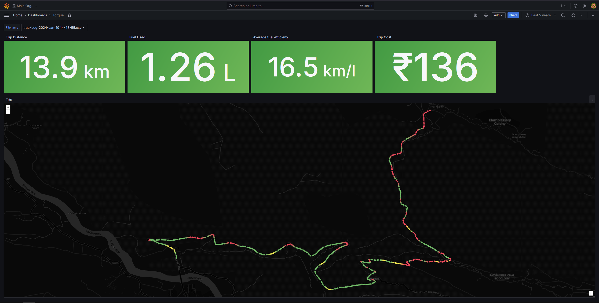

- Parses CSV log files from the Android app [Torque](https://play.google.com/store/apps/details?id=org.prowl.torque&hl=en_IN) and writes them to InfluxDB.
- The data could then be used to represent graphs in Grafana.
- For example: 
